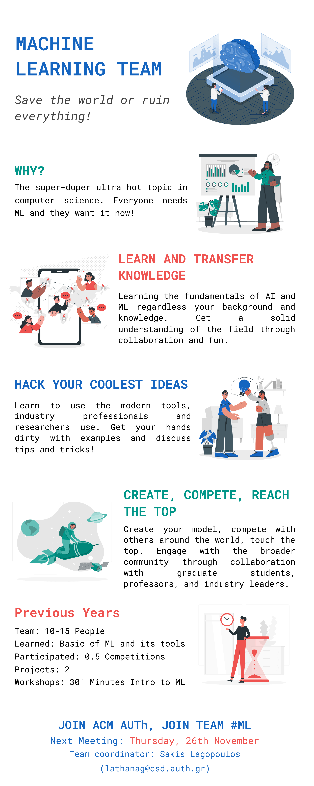

# ACM AUTH Machine Learning #

<b>Table of Contents</b> (click to open)

<!-- MarkdownTOC -->

- [ACM AUTH Machine Learning](#acm-auth-machine-learning)
  - [About](#about)
  - [2020 Timeline](#2020-timeline)
    - [In a :chestnut:shell](#in-a-chestnutshell)
      - [12/11/2020](#12112020)
      - [19/11/2020](#19112020)
      - [26/11/2020](#26112020)
      - [3/12/2020](#3122020)
      - [10/12/2020](#10122020)
      - [17/12/2020](#17122020)
      - [27/02/2021](#27022021)
      - [13/03/2021](#13032021)
      - [27/03/2021](#27032021)

<!-- /MarkdownTOC -->

## About ##
Established in 2018, our team aims to bring together machine learning enthusiasts to explore the fundamentals and trends of machine learning. Check out the team presentation below!

## 2020 Timeline ##

### In a :chestnut:shell ###

#### 12/11/2020 ####

- Get to know each other
- Discussion on how the team will work this year

#### 19/11/2020 ####

:man_teacher: Παρουσίαση: ML Intro in 60 minutes -> https://github.com/acmauth/MachineLearning/tree/master/presentations

:atom_symbol: Βασικά στοιχεία: Τι είναι μηχανική μάθηση και που χρησιμοποιείται, είδη μηχανικής μάθησης, είδη επιβλεπόμενης μάθησης, βασικοί όροι, διαδικασία μάθησης

:hammer_and_wrench: Εργαλεία: Anaconda -> https://www.anaconda.com/products/individual , WSL -> https://docs.microsoft.com/en-us/windows/wsl/about , Jupyter Notebook -> https://jupyter.org/

:spiral_notepad: Περισσότερες Πηγές: https://github.com/acmauth/mlintro/blob/master/README.md#other-resources

:penguin: :goat: Συζήτηση: Λειτουργία ομάδας, θέμα επόμενης εβδομάδας, απορίες & σχολιασμός λειτουργίας

:crystal_ball: Επόμενη συνάντηση :crystal_ball: 

:lizard: Beginners :lizard: 
- Εγκατάσταση Anaconda και set up development environment 
- Run Intro.ipynb -> https://github.com/acmauth/mlintro/blob/master/Machine_Learning_Intro.ipynb
 
:lizard: Beginners :lizard:  & :dragon: Advanced :dragon:
- Αναζήτηση για Γραμμικά Μοντέλα (Linear Models)
- Notebooks, άρθρα, videos, applications κ.α.

#### 26/11/2020 ####

:video_camera: Παρακολούθηση: https://www.coursera.org/learn/machine-learning/home/week/1 (Sections: Model and Cost Function, Parameter Learning)

:spiral_notepad: Notebook: [Medical Insurance Cost (Linear Models)](https://colab.research.google.com/drive/1skld4XqkCSbz4seEORVxVc5kX7jOkplR) (by [@Din0s](https://github.com/din0s/))

:crystal_ball: Επόμενη συνάντηση :crystal_ball: 

:lizard: Beginners :lizard: 
- Μαζεύουμε απορίες σχετικά με τα Γραμμικά Μοντέλα, βιβλιοθήκες και εργαλεία
- Run Intro.ipynb -> https://github.com/acmauth/mlintro/blob/master/Machine_Learning_Intro.ipynb
- Run Notebook by Dinos above

:lizard:Beginners:lizard:  &  :dragon:Advanced:dragon:
- Αναζήτηση για Γραμμικά Μοντέλα - τύποι (SGDClassifier, Multinomial, Regularization etc.) 
- Αναζήτηση για Αξιολόγηση και Μετρικές Αξιολόγησης (evaluation, metrics) 

:star_struck:  EXTRAS  :star_struck: 
- Simplest Linear Regression Problem: https://scikit-learn.org/stable/auto_examples/linear_model/plot_ols.html
- Our GitHub needs update, anyone who wants to help? Please let me know --YEAH WE UPDATED IT!

#### 3/12/2020 ####

:infinity: Παρουσίαση: [Handwriting recognition with k-nn](presentations/ML%20MATLAB%20handwriting%20course/) by [Thanos Kitsakis](https://github.com/kitsakis)

:spiral_notepad: Notebook:
[Fake news detection with PassiveAggressive Classifier](https://colab.research.google.com/drive/126QZFkI6DPqiIDG4mu452_F7JL4sz1Xc?usp=sharing) by [@GregB712](https://github.com/GregB712/)

:fox_face: Συζήτηση: [TF-IDF](https://towardsdatascience.com/natural-language-processing-feature-engineering-using-tf-idf-e8b9d00e7e76), [Online Learning](https://en.wikipedia.org/wiki/Online_machine_learning), [Passive Aggressive Classifier](https://scikit-learn.org/stable/modules/generated/sklearn.linear_model.PassiveAggressiveClassifier.html), [k-nn classifier](https://towardsdatascience.com/machine-learning-basics-with-the-k-nearest-neighbors-algorithm-6a6e71d01761) 

:crystal_ball: Επόμενη συνάντηση :crystal_ball: 

:lizard: Beginners :lizard: 
- Μαζεύουμε απορίες σχετικά με τα Γραμμικά Μοντέλα, βιβλιοθήκες και εργαλεία
- Δημιουργούμε το δικό μας notebook και το παρουσιάζουμε

:dragon: Advanced :dragon:
- Αναζήτηση για Γραμμικά Μοντέλα - τύποι (SGDClassifier, Multinomial, Regularization etc.) 
- Αναζήτηση για Αξιολόγηση και Μετρικές Αξιολόγησης (evaluation, metrics) 
- Οτιδήποτε άλλο σχετικό με γραμμικά μοντέλα

:star_struck:  EXTRAS  :star_struck: 
- We've updated our GitHub

#### 10/12/2020 ####

:spiral_notepad: Notebook: [Evaluation Process & Measure](https://colab.research.google.com/drive/1yl33zmiYs9R6Hspqx2q3l7qtuMJSuLFA?usp=sharing)

:infinity: [Confusion Matrix](https://en.wikipedia.org/wiki/Confusion_matrix)

:wrench: Scikit-learn: [Metrics and scoring: quantifying the quality of predictions](https://scikit-learn.org/stable/modules/model_evaluation.html)

:book:  Article: [Intuitions on L1 and L2 Regularisation](https://towardsdatascience.com/intuitions-on-l1-and-l2-regularisation-235f2db4c261)

:trophy: Competition - Who can achieve the best results using just linear models? Try to train the best linear model for identifying images with digits from 0-9. See more at [Colab Notebook](https://colab.research.google.com/drive/19WrwfiEfTTGi99Z3lZIf0O4ZR5lIDMKt?usp=sharing)
More info on the [MNIST DATASET](http://yann.lecun.com/exdb/mnist/) 

 Submit your code via discord!

:crystal_ball: Επόμενη συνάντηση :crystal_ball: 

:lizard: Beginners :lizard: 
- Μαζεύουμε απορίες σχετικά με τα Γραμμικά Μοντέλα, βιβλιοθήκες και εργαλεία
- Δημιουργούμε το δικό μας notebook και το παρουσιάζουμε

:dragon: Advanced :dragon:
- Αναζήτηση για Data Preprocessing
- Αναζήτηση για Δέντρα Απόφασης (Classification & Regression Trees) :christmas_tree:

#### 17/12/2020 ####

:spiral_notepad: Notebook: [I hacked you](notebooks/I%20hacked%20you.ipynb) - A simple notebook with preprocessing using a croudsourcing dataset predicting whether a student will continue to attend the ML team meetings

:trophy: MNIST Competition: [Winning Notebook](https://colab.research.google.com/drive/1Cv19Gg_zHD2WspeOcKzJMiSc6Xk5pg_U?usp=sharing) by [@Din0s](https://github.com/din0s/)

:trophy: Competition (Continues) - Who can achieve the best results using just linear models? Try to train the best linear model for identifying images with digits from 0-9. See more at [Colab Notebook](https://colab.research.google.com/drive/19WrwfiEfTTGi99Z3lZIf0O4ZR5lIDMKt?usp=sharing)
More info on the [MNIST DATASET](http://yann.lecun.com/exdb/mnist/) 

 Submit your code via discord!

:crystal_ball: **Επόμενη συνάντηση** :crystal_ball: 

:lizard: Beginners :lizard: 
- Μαζεύουμε απορίες σχετικά με αυτά που παρουσιάστηκαν την προηγούμενη συνάντηση
- Δημιουργούμε το δικό μας notebook και το παρουσιάζουμε

:dragon: Advanced :dragon:
- Αναζήτηση για Data Preprocessing
- Αναζήτηση για Δέντρα Απόφασης (Classification & Regression Trees) :christmas_tree:

#### 27/02/2021 ####

:infinity: [Simple Introduction to Decision Trees](https://github.com/Avik-Jain/100-Days-Of-ML-Code#decision-trees--day-23)

:spiral_notepad: [Decision Trees Notebook](notebooks/decision_trees_by_ageron.ipynb) - [Original Source](https://github.com/ageron/handson-ml2/blob/master/06_decision_trees.ipynb) 

:fox_face: Συζήτηση: [CART](https://medium.com/analytics-vidhya/decision-tree-the-cart-algorithm-28c481d28813)

:crystal_ball: **Επόμενη συνάντηση** :crystal_ball: 

:lizard: Beginners :lizard: & :dragon: Advanced :dragon:
- Μαζεύουμε απορίες σχετικά με αυτά που παρουσιάστηκαν την προηγούμενη συνάντηση
- Δημιουργούμε το δικό μας notebook και το παρουσιάζουμε
- Αναζήτηση για **ensembles models** 
- Αναζήτηση για αναπαραστάσεις κειμένου, video, ήχου κ.α. και αντίστοιχα tasks. 

#### 13/03/2021 ####
:man_teacher: Παρουσίαση: [PCA Whitening](http://ufldl.stanford.edu/tutorial/unsupervised/PCAWhitening/) by [@Din0s](https://github.com/din0s/)

:paintbrush: Εισαγωγή στα Ensembles, μέθοδοι Voting

:crystal_ball: **Επόμενη συνάντηση** :crystal_ball: 

- Μαζεύουμε απορίες σχετικά με αυτά που παρουσιάστηκαν την προηγούμενη συνάντηση
- Αναζήτηση για **ensembles models** 
- Αναζήτηση για αναπαραστάσεις κειμένου, video, ήχου κ.α. και αντίστοιχα tasks. 

#### 27/03/2021 ####

:man_teacher: Ensembles: Stacking, Bagging, Boosting

:spiral_notepad: Σημειώσεις Μαθήματος [Μηχανική Μάθηση](https://elearning.auth.gr/course/view.php?id=11553) 

:star_struck:  Extra: [Sound Classification using Deep Learning](https://mikesmales.medium.com/sound-classification-using-deep-learning-8bc2aa1990b7) & [Notebook](https://github.com/mikesmales/Udacity-ML-Capstone)

:crystal_ball: **Επόμενη συνάντηση** :crystal_ball: 

- Παραδείγματα σε **Ensembles** 
- Histogram Based Gradient Boosting
- Support Vector Machine (SVMs)